# 🏗️ Arquitectura de ApiMovil .NET 8

## Visión General

ApiMovil implementa una arquitectura basada en **Clean Architecture** y **Domain-Driven Design (DDD)** para garantizar mantenibilidad, testabilidad y escalabilidad. La aplicación actúa como un API Gateway que coordina la comunicación con múltiples microservicios backend.

## 🎯 Principios Arquitectónicos

### 1. Separation of Concerns
Cada capa tiene responsabilidades bien definidas y no depende de implementaciones específicas de capas superiores.

### 2. Dependency Inversion
Las dependencias apuntan hacia abstracciones, no hacia implementaciones concretas.

### 3. Single Responsibility
Cada clase y módulo tiene una sola razón para cambiar.

### 4. Microservices Integration
Comunicación resiliente con servicios externos usando patrones de tolerancia a fallos.

## 📐 Diagrama de Arquitectura

```mermaid
graph TB
    subgraph "Client Applications"
        MA[Mobile App]
        WA[Web App]
        API[API Clients]
    end
    
    subgraph "ApiMovil .NET 8"
        subgraph "Presentation Layer"
            AC[Controllers]
            MW[Middleware]
            FI[Filters]
        end
        
        subgraph "Application Layer"
            AS[Application Services]
            VA[Validators]
            MP[Mappers]
        end
        
        subgraph "Infrastructure Layer"
            HR[HTTP Repositories]
            CA[Cache Service]
            LO[Logging Service]
            AU[Auth Service]
        end
        
        subgraph "Domain Layer"
            EN[Entities]
            VO[Value Objects]
            DT[DTOs]
        end
        
        subgraph "Shared Layer"
            CO[Common]
            EX[Exceptions]
            UT[Utils]
        end
    end
    
    subgraph "External Systems"
        subgraph "Backend Microservices"
            MS1[Socios Service]
            MS2[Credenciales Service]
            MS3[Autorizaciones Service]
            MS4[Reintegros Service]
            MS5[Prestadores Service]
            MS6[+ 10 más...]
        end
        
        subgraph "Infrastructure Services"
            RE[Redis Cache]
            SE[Seq Logging]
            AI[App Insights]
            NR[New Relic]
        end
    end
    
    MA --> AC
    WA --> AC
    API --> AC
    
    AC --> AS
    AS --> HR
    HR --> MS1
    HR --> MS2
    HR --> MS3
    HR --> MS4
    HR --> MS5
    HR --> MS6
    
    AS --> CA
    AS --> LO
    AS --> AU
    
    CA --> RE
    LO --> SE
    LO --> AI
    LO --> NR
```



## 🏛️ Capas de la Aplicación

### 1. Presentation Layer (ApiMovil.Api)

**Responsabilidades:**
- Manejo de requests HTTP
- Validación de entrada
- Serialización/deserialización
- Manejo de errores
- Documentación de API

**Componentes principales:**
- **Controllers**: Endpoints de la API REST
- **Middleware**: Cross-cutting concerns (logging, error handling, security)
- **Filters**: Validaciones y transformaciones
- **Program.cs**: Configuración de la aplicación

```csharp
[ApiController]
[Route("api/[controller]")]
[RequireActiveSocio]
public class SociosController : ControllerBase
{
    private readonly ISocioAppService _socioAppService;
    
    public SociosController(ISocioAppService socioAppService)
    {
        _socioAppService = socioAppService;
    }
    
    [HttpGet("{numeroSocio}")]
    [RequireOwnResource]
    public async Task<ActionResult<SocioResponseDto>> GetSocio(string numeroSocio)
    {
        var socio = await _socioAppService.GetSocioAsync(numeroSocio);
        return Ok(socio);
    }
}
```

### 2. Application Layer (ApiMovil.Application)

**Responsabilidades:**
- Orquestación de la lógica de negocio
- Validación de reglas de negocio
- Mapeo entre DTOs y entidades
- Coordinación con servicios externos

**Componentes principales:**
- **Application Services**: Orquestación de casos de uso
- **DTOs**: Data Transfer Objects
- **Validators**: Validación con FluentValidation
- **Mappers**: Configuración de AutoMapper

```csharp
public class SocioAppService : ISocioAppService
{
    private readonly ISocioRepository _socioRepository;
    private readonly IMapper _mapper;
    private readonly IValidator<SocioRequestDto> _validator;
    
    public async Task<SocioResponseDto> GetSocioAsync(string numeroSocio)
    {
        // Validación
        ValidateNumeroSocio(numeroSocio);
        
        // Obtener datos del microservicio
        var socio = await _socioRepository.GetSocioAsync(numeroSocio);
        
        // Mapear a DTO
        return _mapper.Map<SocioResponseDto>(socio);
    }
}
```

### 3. Infrastructure Layer (ApiMovil.Infrastructure)

**Responsabilidades:**
- Comunicación con servicios externos
- Implementación de repositorios HTTP
- Configuración de resiliencia
- Servicios de infraestructura (cache, logging)

**Componentes principales:**
- **HTTP Repositories**: Comunicación con microservicios
- **Resilience Policies**: Polly para retry, circuit breaker, timeout
- **Cache Service**: Implementación de cache distribuido
- **Security**: Autenticación y autorización

```csharp
public class SocioHttpRepository : ISocioRepository
{
    private readonly HttpClient _httpClient;
    private readonly IAsyncPolicy<HttpResponseMessage> _retryPolicy;
    
    public async Task<Socio> GetSocioAsync(string numeroSocio)
    {
        var response = await _retryPolicy.ExecuteAsync(async () =>
        {
            return await _httpClient.GetAsync($"/api/socios/{numeroSocio}");
        });
        
        response.EnsureSuccessStatusCode();
        
        var content = await response.Content.ReadAsStringAsync();
        return JsonSerializer.Deserialize<Socio>(content);
    }
}
```

### 4. Domain Layer (ApiMovil.Domain)

**Responsabilidades:**
- Definición de entidades de dominio
- Value Objects
- Reglas de negocio
- Especificaciones

**Componentes principales:**
- **Entities**: Entidades del dominio
- **Value Objects**: Objetos de valor inmutables
- **Enums**: Enumeraciones del dominio
- **Specifications**: Especificaciones de negocio

```csharp
public class Socio
{
    public string NumeroSocio { get; init; } = string.Empty;
    public string Nombre { get; init; } = string.Empty;
    public string Apellido { get; init; } = string.Empty;
    public string Documento { get; init; } = string.Empty;
    public EstadoSocio Estado { get; init; }
    public PlanCobertura PlanCobertura { get; init; }
    public bool EsTitular { get; init; }
    public DateTime FechaAlta { get; init; }
    
    public bool EstaActivo() => Estado == EstadoSocio.Activo;
    public bool PuedeAccederPremium() => 
        PlanCobertura.EsPremium() && EstaActivo();
}
```

### 5. Shared Layer (ApiMovil.Shared)

**Responsabilidades:**
- Utilidades comunes
- Excepciones personalizadas
- Extensiones
- Constantes globales

## 🔄 Patrones de Comunicación

### 1. HTTP Repository Pattern

Abstrae la comunicación con microservicios usando repositorios HTTP:

```csharp
public interface ISocioRepository
{
    Task<Socio> GetSocioAsync(string numeroSocio);
    Task<IEnumerable<Socio>> GetSociosAsync(SocioFilter filter);
    Task<Socio> UpdateSocioAsync(string numeroSocio, SocioUpdate update);
}

public class SocioHttpRepository : ISocioRepository
{
    // Implementación usando HttpClient + Polly
}
```

### 2. Resilience Patterns

Implementación de patrones de tolerancia a fallos:

```csharp
// Retry Policy
var retryPolicy = Policy
    .Handle<HttpRequestException>()
    .WaitAndRetryAsync(
        retryCount: 3,
        sleepDurationProvider: retryAttempt => 
            TimeSpan.FromSeconds(Math.Pow(2, retryAttempt)));

// Circuit Breaker
var circuitBreakerPolicy = Policy
    .Handle<HttpRequestException>()
    .CircuitBreakerAsync(
        handledEventsAllowedBeforeBreaking: 5,
        durationOfBreak: TimeSpan.FromSeconds(30));

// Timeout Policy  
var timeoutPolicy = Policy.TimeoutAsync<HttpResponseMessage>(10);

// Combined Policy
var combinedPolicy = Policy.WrapAsync(retryPolicy, circuitBreakerPolicy, timeoutPolicy);
```

### 3. Cache-Aside Pattern

Implementación de cache distribuido con Redis:

```csharp
public async Task<Socio> GetSocioAsync(string numeroSocio)
{
    // 1. Check cache
    var cacheKey = $"socio:{numeroSocio}";
    var cached = await _cache.GetAsync<Socio>(cacheKey);
    if (cached != null)
        return cached;
    
    // 2. Get from service
    var socio = await _httpRepository.GetSocioAsync(numeroSocio);
    
    // 3. Update cache
    await _cache.SetAsync(cacheKey, socio, TimeSpan.FromMinutes(30));
    
    return socio;
}
```

## 🔐 Arquitectura de Seguridad

### 1. Authentication Flow


### 2. Authorization Policies

```csharp
services.AddAuthorization(options =>
{
    options.AddPolicy("RequireTitular", policy =>
        policy.RequireClaim("EsTitular", "True"));
        
    options.AddPolicy("RequireSocioActivo", policy =>
        policy.RequireClaim("Estado", "ACTIVO"));
        
    options.AddPolicy("CanAccessPremiumFeatures", policy =>
        policy.Requirements.Add(new PremiumAccessRequirement()));
});
```

### 3. Custom Authorization Handlers

```csharp
public class OwnResourceAuthorizationHandler : 
    AuthorizationHandler<OwnResourceRequirement>
{
    protected override Task HandleRequirementAsync(
        AuthorizationHandlerContext context,
        OwnResourceRequirement requirement)
    {
        var userNumeroSocio = context.User.FindFirst("NumeroSocio")?.Value;
        var routeNumeroSocio = GetRouteValue("numeroSocio");
        
        if (userNumeroSocio == routeNumeroSocio)
            context.Succeed(requirement);
        
        return Task.CompletedTask;
    }
}
```

## 📊 Arquitectura de Observabilidad

### 1. Structured Logging

```csharp
public class SocioAppService : ISocioAppService
{
    private readonly ILogger<SocioAppService> _logger;
    
    public async Task<SocioResponseDto> GetSocioAsync(string numeroSocio)
    {
        using var scope = _logger.BeginScope(new Dictionary<string, object>
        {
            ["Operation"] = "GetSocio",
            ["NumeroSocio"] = numeroSocio
        });
        
        _logger.LogInformation("Iniciando obtención de socio {NumeroSocio}", numeroSocio);
        
        try
        {
            var socio = await _socioRepository.GetSocioAsync(numeroSocio);
            _logger.LogInformation("Socio obtenido exitosamente");
            return _mapper.Map<SocioResponseDto>(socio);
        }
        catch (Exception ex)
        {
            _logger.LogError(ex, "Error al obtener socio {NumeroSocio}", numeroSocio);
            throw;
        }
    }
}
```

### 2. Health Checks

```csharp
services.AddHealthChecks()
    .AddCheck<MicroservicesHealthCheck>("microservices")
    .AddCheck<RedisHealthCheck>("redis")
    .AddCheck<SqlServerHealthCheck>("database");
```

### 3. Metrics and Telemetry

```csharp
// Custom metrics
public class MetricsService
{
    private readonly IMetrics _metrics;
    
    public void RecordApiCall(string endpoint, string method, int statusCode, double duration)
    {
        _metrics.Measure.Counter.Increment(
            MetricsRegistry.ApiCalls,
            new MetricTags("endpoint", endpoint, "method", method, "status", statusCode.ToString()));
            
        _metrics.Measure.Histogram.Update(
            MetricsRegistry.ApiDuration,
            duration,
            new MetricTags("endpoint", endpoint));
    }
}
```

## 🚀 Decisiones Arquitectónicas

### 1. ¿Por qué Clean Architecture?

**Ventajas:**
- ✅ Testabilidad superior
- ✅ Independencia de frameworks
- ✅ Separación clara de responsabilidades
- ✅ Facilita el mantenimiento

**Desventajas:**
- ❌ Mayor complejidad inicial
- ❌ Más código boilerplate

### 2. ¿Por qué HTTP Repositories?

**Ventajas:**
- ✅ Abstracción clara de la comunicación
- ✅ Facilita testing con mocks
- ✅ Aplicación de políticas de resiliencia
- ✅ Cache transparente

**Desventajas:**
- ❌ Overhead de abstracción
- ❌ Puede ser overkill para APIs simples

### 3. ¿Por qué Polly para Resiliencia?

**Ventajas:**
- ✅ Políticas de retry configurables
- ✅ Circuit breaker pattern
- ✅ Timeouts configurables
- ✅ Métricas automáticas

**Desventajas:**
- ❌ Complejidad adicional
- ❌ Configuración detallada requerida

## 🔮 Evolución Futura

### Próximas Mejoras

1. **Event-Driven Architecture**: Implementación de eventos para comunicación asíncrona
2. **CQRS Pattern**: Separación de comandos y consultas
3. **GraphQL**: API más flexible para clientes
4. **gRPC**: Comunicación de alto rendimiento con microservicios
5. **Service Mesh**: Istio para comunicación entre servicios

### Refactorings Planeados

1. **Domain Services**: Extraer lógica compleja del application layer
2. **Specification Pattern**: Queries más complejas y reutilizables  
3. **Repository Caching**: Cache automático en repositorios
4. **Background Services**: Procesamiento asíncrono de tareas

---

Esta arquitectura proporciona una base sólida para el crecimiento y evolución de ApiMovil, manteniendo la flexibilidad para adaptarse a nuevos requisitos y tecnologías.