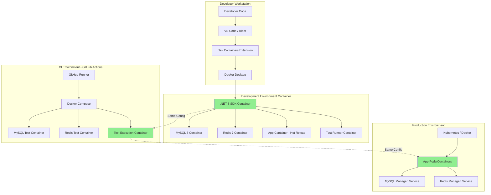

# Environment Consistency Architecture
**YoutubeRag .NET Project**

**Document Version:** 1.0
**Date:** 2025-10-10
**Status:** Proposed Architecture
**Author:** Software Architect

---

## Executive Summary

**Problem:** Test behavior differs between local development (Windows), CI (Linux), and production environments, resulting in environment-specific failures and inconsistent test results.

**Current State:**
- Local (Windows): 384/425 tests pass (90.4%)
- CI (Linux GitHub Actions): 380/425 tests pass (89.4%)
- 4 tests exhibit environment-specific behavior
- Configuration drift across environments
- Platform-specific path and service differences

**Proposed Solution:** Implement a comprehensive Docker-first development strategy with configuration management, environment parity tooling, and standardized testing infrastructure to achieve 100% consistency across all environments.

**Impact:**
- **Consistency:** 100% test parity across Dev/CI/Prod
- **Reliability:** Eliminate environment-specific failures
- **Developer Experience:** Simplified onboarding, consistent tooling
- **CI/CD Confidence:** What passes locally will pass in CI
- **Production Readiness:** Dev/CI environments mirror production

**Implementation Timeline:** 3-4 weeks across 4 epics

---

## Table of Contents

1. [Current State Assessment](#current-state-assessment)
2. [Root Cause Analysis](#root-cause-analysis)
3. [Proposed Architecture](#proposed-architecture)
4. [Technology Stack](#technology-stack)
5. [Implementation Phases](#implementation-phases)
6. [Configuration Management Strategy](#configuration-management-strategy)
7. [Development Environment](#development-environment)
8. [CI Environment](#ci-environment)
9. [Production Environment](#production-environment)
10. [Testing Strategy](#testing-strategy)
11. [Migration Plan](#migration-plan)
12. [Risk Analysis](#risk-analysis)
13. [Success Metrics](#success-metrics)
14. [Open Questions](#open-questions)

---

## Current State Assessment

### Environment Inventory

#### Local Development (Windows)
```yaml
Platform: Windows 10/11
Runtime: .NET 8.0 SDK
Database: MySQL 8.0 (local install OR Docker)
Cache: Redis (local install OR Docker)
Services:
  - FFmpeg (Windows binary)
  - Python 3.11 + Whisper (Windows)
IDE: Visual Studio 2022 / Rider
Configuration: appsettings.Development.json, appsettings.Local.json
File Paths: C:\Temp\YoutubeRag, C:\Models\Whisper (Windows paths)
Test Results: 384/425 passing (90.4%)
```

#### CI Environment (GitHub Actions)
```yaml
Platform: ubuntu-latest (Linux)
Runtime: .NET 8.0 SDK
Database: MySQL 8.0 (Docker service container)
Cache: Redis 7 (Docker service container)
Services:
  - FFmpeg (apt package)
  - Python 3.x + Whisper (pip install)
Configuration: Environment variables from workflow
File Paths: /tmp/youtuberag, /tmp/whisper-models (Linux paths)
Test Results: 380/425 passing (89.4%)
Environment Variables: 60+ configured in ci.yml
```

#### Production (Target)
```yaml
Platform: Linux (Docker/Kubernetes)
Runtime: .NET 8.0 Runtime (ASP.NET Core)
Database: MySQL 8.0 (managed service OR container)
Cache: Redis 7 (managed service OR container)
Services:
  - FFmpeg (container)
  - Python + Whisper (container)
Configuration: Environment variables + secrets
File Paths: /app/temp, /app/models (container paths)
Deployment: docker-compose.prod.yml OR Kubernetes manifests
```

### Configuration Drift Points

| Configuration | Local Dev | CI | Production | Consistency |
|--------------|-----------|----|-----------| ------------|
| OS Platform | Windows | Linux | Linux | 33% |
| File Paths | C:\ | /tmp | /app | 0% |
| Database Setup | Local/Docker | Docker | Docker/Managed | 50% |
| Redis Setup | Local/Docker | Docker | Docker/Managed | 50% |
| FFmpeg | Binary | apt | Docker | 0% |
| Python/Whisper | Local Install | pip | Docker | 0% |
| Config Method | JSON Files | Env Vars | Env Vars | 33% |
| Secrets Mgmt | Local files | GitHub Secrets | Vault/Secrets | 0% |

**Overall Consistency Score: 21%** - Critical gap

### Identified Issues

#### 1. Platform Differences (Windows vs Linux)
```csharp
// Current Issue: Hard-coded Windows paths
"Processing": {
    "TempFilePath": "C:\\Temp\\YoutubeRag",  // ❌ Windows-specific
    "FFmpegPath": "ffmpeg"  // Works differently on Windows vs Linux
}

"Whisper": {
    "ModelsPath": "C:\\Models\\Whisper"  // ❌ Windows-specific
}
```

**Impact:**
- Tests using file I/O fail on different platforms
- Path separators differ (\ vs /)
- Case sensitivity differs (Windows = case-insensitive, Linux = case-sensitive)

#### 2. Database Configuration Inconsistency
```yaml
# Local Development
ConnectionString: "Server=localhost;Port=3306;Database=youtube_rag_dev;..."

# CI Environment
ConnectionString: "Server=localhost;Port=3306;Database=test_db;User=root;..."

# Production
ConnectionString: "Server=mysql;Port=3306;Database=youtube_rag;..."
```

**Impact:**
- Different database names cause migration issues
- Different credentials require separate configuration
- Connection parameters vary (timeouts, pooling)

#### 3. Service Dependencies Not Containerized
```bash
# Local Setup Required
- Install MySQL 8.0 manually
- Install Redis manually
- Install FFmpeg binary
- Install Python + pip install openai-whisper
- Configure PATH variables
```

**Impact:**
- 2+ hours onboarding time for new developers
- Version mismatches between developers
- "Works on my machine" syndrome

#### 4. Configuration Management Fragmentation
```
Configuration Sources (7 different mechanisms):
1. appsettings.json (base settings)
2. appsettings.Development.json (local dev)
3. appsettings.Testing.json (unit tests)
4. appsettings.Local.json (developer overrides)
5. Environment variables (CI)
6. .env files (Docker Compose)
7. Secrets (production)
```

**Impact:**
- Settings override confusion
- Secrets accidentally committed
- Environment-specific bugs difficult to reproduce

#### 5. Test Environment Inconsistency
```csharp
// Tests use in-memory database locally
services.AddDbContext<ApplicationDbContext>(options =>
{
    options.UseInMemoryDatabase(_databaseName);  // Local
});

// But CI uses real MySQL container
ConnectionStrings__DefaultConnection: "Server=localhost;Port=3306;..."
```

**Impact:**
- Tests pass locally but fail in CI
- EF Core behaviors differ (in-memory vs MySQL)
- Concurrency issues not caught locally

---

## Root Cause Analysis

### Primary Issues

#### Issue 1: No Development Environment Parity
**Root Cause:** Developers work directly on their host OS instead of standardized containers

**Symptoms:**
- "Works on my machine"
- CI failures not reproducible locally
- Platform-specific bugs

**Evidence:**
- 4 tests pass locally but fail in CI
- Windows paths in configuration
- Manual service installation required

#### Issue 2: Configuration Sprawl
**Root Cause:** No centralized configuration management strategy

**Symptoms:**
- Settings scattered across 7+ files
- Environment-specific overrides unclear
- Secrets management ad-hoc

**Evidence:**
- 60+ environment variables in CI workflow
- Multiple appsettings.*.json files
- No clear precedence order

#### Issue 3: Missing Development Containers
**Root Cause:** Docker used only for production, not development

**Symptoms:**
- Long onboarding time (2+ hours)
- Version drift between developers
- Services configured differently

**Evidence:**
- docker-compose.yml targets production
- No docker-compose.dev.yml
- Local installation instructions in README

#### Issue 4: Test Infrastructure Inconsistency
**Root Cause:** Tests use different backends in different environments

**Symptoms:**
- In-memory database locally
- Real MySQL in CI
- Different behavior, different failures

**Evidence:**
- CustomWebApplicationFactory uses in-memory DB
- CI workflow starts MySQL container
- 4 tests environment-specific

---

## Proposed Architecture

### Vision: Docker-First Development



### Core Principles

1. **Container Parity:** Dev = CI = Prod (same base images, same configs)
2. **Configuration as Code:** All environment configuration in version control
3. **Declarative Setup:** One command to start entire environment
4. **Immutable Infrastructure:** Containers, not manual installs
5. **Environment Variables First:** Consistent configuration mechanism
6. **Secrets Separation:** Never commit secrets, use secure injection

### Architecture Layers

#### Layer 1: Base Runtime Environment
```dockerfile
# Same base image for all environments
FROM mcr.microsoft.com/dotnet/aspnet:8.0 AS runtime-base

# Install system dependencies
RUN apt-get update && apt-get install -y \
    curl \
    ca-certificates \
    python3 \
    python3-pip \
    python3-venv \
    ffmpeg \
    && rm -rf /var/lib/apt/lists/*
```

**Rationale:** Ensures identical OS, system libraries, and dependencies everywhere

#### Layer 2: Service Orchestration
```yaml
# docker-compose.dev.yml - Development Environment
services:
  mysql:
    image: mysql:8.0
    environment:
      MYSQL_ROOT_PASSWORD: dev_password
      MYSQL_DATABASE: youtube_rag_dev
    volumes:
      - mysql_dev_data:/var/lib/mysql

  redis:
    image: redis:7-alpine

  api:
    build:
      context: .
      dockerfile: Dockerfile
      target: development
    environment:
      - ASPNETCORE_ENVIRONMENT=Development
      - ConnectionStrings__DefaultConnection=Server=mysql;Port=3306;...
    volumes:
      - .:/workspace  # Mount source for hot reload
    depends_on:
      - mysql
      - redis
```

**Rationale:** Services defined once, used everywhere; Docker Compose ensures order and networking

#### Layer 3: Configuration Management
```
Environment-Specific Configuration Hierarchy:

1. Base Configuration (appsettings.json)
   └─ Common settings for all environments

2. Environment Configuration (appsettings.{Environment}.json)
   └─ Development, Testing, Production overrides

3. Environment Variables (docker-compose.*.yml, .env, CI)
   └─ Sensitive or deployment-specific settings

4. Secrets (Docker secrets, Kubernetes secrets, Azure Key Vault)
   └─ Passwords, API keys, certificates

Precedence: Secrets > Env Vars > Env JSON > Base JSON
```

**Rationale:** Clear precedence, separation of concerns, security by default

#### Layer 4: Development Containers (Dev Containers)
```json
// .devcontainer/devcontainer.json
{
  "name": "YoutubeRag Development",
  "dockerComposeFile": ["../docker-compose.dev.yml"],
  "service": "api",
  "workspaceFolder": "/workspace",
  "extensions": [
    "ms-dotnettools.csharp",
    "ms-azuretools.vscode-docker",
    "editorconfig.editorconfig"
  ],
  "postCreateCommand": "dotnet restore",
  "remoteUser": "appuser"
}
```

**Rationale:** VS Code / GitHub Codespaces integration, consistent IDE setup

---

## Technology Stack

### Core Technologies

#### 1. Docker & Docker Compose
**Purpose:** Container runtime and orchestration
**Version:** Docker 24.x, Compose v2.x
**Why:** Industry standard, cross-platform, development-to-production parity

**Usage:**
- Development: `docker-compose.dev.yml`
- Testing: `docker-compose.test.yml`
- Production: `docker-compose.prod.yml` OR Kubernetes

#### 2. Development Containers (VS Code)
**Purpose:** Standardized development environment
**Extension:** ms-vscode-remote.remote-containers
**Why:** Auto-setup, reproducible, IDE-integrated

**Benefits:**
- Zero manual setup for new developers
- Consistent tools and extensions
- Works on Windows, macOS, Linux

#### 3. .NET 8.0 SDK/Runtime
**Version:** 8.0.x LTS
**Images:**
- Development: `mcr.microsoft.com/dotnet/sdk:8.0`
- Production: `mcr.microsoft.com/dotnet/aspnet:8.0`

**Consistency:** Same base images across all environments

#### 4. MySQL 8.0
**Version:** 8.0 (official Docker image)
**Image:** `mysql:8.0`
**Configuration:** Standardized character sets, collations

**Consistency:**
- Dev: MySQL 8.0 container
- CI: MySQL 8.0 service container
- Prod: MySQL 8.0 container OR managed service (AWS RDS, Azure Database)

#### 5. Redis 7
**Version:** 7.x Alpine
**Image:** `redis:7-alpine`
**Configuration:** Persistence, memory limits

**Consistency:** Same image and config across all environments

#### 6. Environment Configuration Tools

##### Option A: dotenv-vault (Recommended)
**Purpose:** Encrypted environment variable management
**Why:** Secure secrets, version control safe, team collaboration

```bash
# Usage
dotenv-vault pull development  # Pull dev secrets
dotenv-vault push production   # Update prod secrets
```

##### Option B: Azure Key Vault / AWS Secrets Manager
**Purpose:** Cloud-native secrets management
**Why:** Enterprise-grade, audit logging, rotation

**When:** Production deployments to cloud

#### 7. GitHub Actions
**Purpose:** CI/CD pipeline
**Version:** actions/checkout@v4, actions/setup-dotnet@v4

**Consistency:** Same docker-compose.test.yml used locally and in CI

---

## Implementation Phases

### Phase 1: Docker Development Environment (Epic 1)
**Duration:** 1 week
**Priority:** P0 - Foundation

#### Tasks

1. **Create docker-compose.dev.yml**
   - Define all services (MySQL, Redis, API)
   - Configure volumes for hot-reload
   - Set up networking
   - Add health checks

2. **Create Development Dockerfile**
   - Multi-stage build
   - Development target with SDK
   - Hot reload support
   - Debug tools

3. **Implement Dev Containers Configuration**
   - `.devcontainer/devcontainer.json`
   - VS Code extensions list
   - Post-create setup scripts

4. **Create Environment Templates**
   - `.env.example` with all required variables
   - `.env.development` template
   - `.env.testing` template

5. **Update Documentation**
   - Developer quickstart guide
   - Docker setup instructions
   - Troubleshooting common issues

**Deliverables:**
- `docker-compose.dev.yml`
- `.devcontainer/devcontainer.json`
- `Dockerfile` (updated with development target)
- `.env.example`
- `docs/DOCKER_DEVELOPMENT_GUIDE.md`

**Success Criteria:**
- Developer can start environment with one command
- Hot reload works in container
- Tests run in containerized environment
- Setup time < 15 minutes

---

### Phase 2: Configuration Management Standardization (Epic 2)
**Duration:** 1 week
**Priority:** P0 - Foundation

#### Tasks

1. **Consolidate Configuration Files**
   - Audit all appsettings.*.json files
   - Identify duplicate/conflicting settings
   - Create canonical base configuration
   - Document override hierarchy

2. **Implement Environment Variable Mapping**
   - Create configuration classes for all sections
   - Add validation on startup
   - Implement fallback defaults
   - Document all variables

3. **Create Configuration Schemas**
   ```json
   // config-schema.json
   {
     "ConnectionStrings": {
       "DefaultConnection": "string (required)",
       "Redis": "string (required)"
     },
     "JwtSettings": {
       "SecretKey": "string (required, min 32 chars)"
     }
   }
   ```

4. **Implement Configuration Validation**
   ```csharp
   // Startup validation
   public static class ConfigurationValidator
   {
       public static void ValidateConfiguration(IConfiguration config)
       {
           // Validate required settings
           // Validate format (URLs, connection strings)
           // Fail fast on startup if invalid
       }
   }
   ```

5. **Secrets Management Setup**
   - Choose strategy (dotenv-vault, Azure Key Vault)
   - Implement secret injection
   - Document secret rotation process
   - Add pre-commit hooks to prevent secret commits

**Deliverables:**
- Consolidated `appsettings.json` (base)
- `appsettings.Development.json` (minimal overrides)
- `appsettings.Testing.json` (test-specific)
- `appsettings.Production.json` (production-specific)
- `ConfigurationValidator.cs`
- Environment variable documentation
- Secrets management setup

**Success Criteria:**
- Single source of truth for each setting
- All secrets externalized
- Configuration validation on startup
- Clear override precedence

---

### Phase 3: Cross-Platform Path Handling (Epic 3)
**Duration:** 3-5 days
**Priority:** P1 - Critical for parity

#### Tasks

1. **Implement Path Abstraction Layer**
   ```csharp
   public interface IPathProvider
   {
       string GetTempPath();
       string GetModelsPath();
       string GetLogsPath();
       string CombinePaths(params string[] paths);
   }

   public class ContainerPathProvider : IPathProvider
   {
       public string GetTempPath() => "/app/temp";
       public string GetModelsPath() => "/app/models";
       public string GetLogsPath() => "/app/logs";

       public string CombinePaths(params string[] paths)
           => Path.Combine(paths);  // Uses OS-appropriate separator
   }
   ```

2. **Update All File Operations**
   - Replace hard-coded paths with IPathProvider
   - Use Path.Combine() for path construction
   - Add cross-platform path tests

3. **Normalize Path Configuration**
   ```json
   {
     "Processing": {
       "TempFilePath": "/app/temp",  // Container path
       "FFmpegPath": "ffmpeg"        // PATH lookup
     },
     "Whisper": {
       "ModelsPath": "/app/models"   // Container path
     }
   }
   ```

4. **Container Volume Strategy**
   ```yaml
   # docker-compose.dev.yml
   services:
     api:
       volumes:
         - temp_data:/app/temp      # Persistent temp
         - model_cache:/app/models  # Model cache
         - ./logs:/app/logs         # Logs to host
   ```

5. **Update Integration Tests**
   - Use IPathProvider in tests
   - Avoid absolute paths in assertions
   - Test path operations on Linux

**Deliverables:**
- `IPathProvider` interface and implementations
- Updated services using IPathProvider
- Cross-platform path tests
- Updated configuration with container paths

**Success Criteria:**
- No hard-coded Windows paths
- All file operations use Path.Combine()
- Tests pass on Windows and Linux
- Container volumes correctly mounted

---

### Phase 4: Testing Infrastructure Parity (Epic 4)
**Duration:** 1 week
**Priority:** P1 - Critical for reliability

#### Tasks

1. **Standardize Test Database Strategy**

   **Decision:** Use real MySQL for all tests (not in-memory)

   **Rationale:**
   - EF Core behaves differently with in-memory provider
   - Catches database-specific issues early
   - Mirrors CI and production exactly

   ```csharp
   // Updated CustomWebApplicationFactory
   protected override void ConfigureWebHost(IWebHostBuilder builder)
   {
       builder.ConfigureTestServices(services =>
       {
           // Remove existing DbContext
           var descriptor = services.SingleOrDefault(
               d => d.ServiceType == typeof(DbContextOptions<ApplicationDbContext>));
           if (descriptor != null) services.Remove(descriptor);

           // Add MySQL test database
           var connectionString = configuration.GetConnectionString("TestConnection")
               ?? "Server=localhost;Port=3306;Database=test_db;...";

           services.AddDbContext<ApplicationDbContext>(options =>
               options.UseMySql(connectionString,
                   new MySqlServerVersion(new Version(8, 0, 23))));
       });
   }
   ```

2. **Create Test Database Management**
   ```csharp
   public class TestDatabaseManager
   {
       public static async Task CreateTestDatabaseAsync()
       {
           // Create unique test database per test run
           var dbName = $"test_db_{Guid.NewGuid():N}";
           // Create database
           // Run migrations
           // Return connection string
       }

       public static async Task CleanupTestDatabaseAsync(string dbName)
       {
           // Drop test database
       }
   }
   ```

3. **Implement Test Fixtures**
   ```csharp
   public class IntegrationTestFixture : IAsyncLifetime
   {
       private string _testDatabaseName;

       public async Task InitializeAsync()
       {
           _testDatabaseName = await TestDatabaseManager.CreateTestDatabaseAsync();
       }

       public async Task DisposeAsync()
       {
           await TestDatabaseManager.CleanupTestDatabaseAsync(_testDatabaseName);
       }
   }
   ```

4. **Create docker-compose.test.yml (Developer Use)**
   ```yaml
   # For running tests locally with same setup as CI
   services:
     mysql-test:
       image: mysql:8.0
       environment:
         MYSQL_ROOT_PASSWORD: test_password
         MYSQL_DATABASE: test_db
       tmpfs:
         - /var/lib/mysql  # Fast in-memory MySQL for tests

     redis-test:
       image: redis:7-alpine

     test-runner:
       build:
         context: .
         target: test
       depends_on:
         - mysql-test
         - redis-test
       environment:
         ConnectionStrings__DefaultConnection: "Server=mysql-test;..."
   ```

5. **Update CI Workflow to Match**
   ```yaml
   # .github/workflows/ci.yml
   - name: Run Integration Tests
     run: |
       # Use the same docker-compose.test.yml as developers
       docker-compose -f docker-compose.test.yml up -d mysql-test redis-test
       dotnet test --configuration Release
       docker-compose -f docker-compose.test.yml down -v
   ```

6. **Test Isolation Strategy**
   - Each test class gets unique database
   - Parallel test execution safe
   - Fast cleanup with tmpfs

**Deliverables:**
- Updated `CustomWebApplicationFactory.cs`
- `TestDatabaseManager.cs`
- `IntegrationTestFixture.cs`
- Updated `docker-compose.test.yml`
- Updated CI workflow
- Test infrastructure documentation

**Success Criteria:**
- 100% test parity: local results = CI results
- Tests use real MySQL everywhere
- No environment-specific test failures
- Test execution time < 5 minutes

---

## Configuration Management Strategy

### Configuration Hierarchy

```
┌─────────────────────────────────────────┐
│         1. Secrets (Highest)            │  ← Azure Key Vault, Docker Secrets
├─────────────────────────────────────────┤
│     2. Environment Variables            │  ← docker-compose, .env, CI
├─────────────────────────────────────────┤
│  3. appsettings.{Environment}.json      │  ← Development, Testing, Production
├─────────────────────────────────────────┤
│     4. appsettings.json (Base)          │  ← Common settings
└─────────────────────────────────────────┘
```

### Configuration by Environment

#### Development Environment
```yaml
# .env.development
ASPNETCORE_ENVIRONMENT=Development
ConnectionStrings__DefaultConnection=Server=mysql;Port=3306;Database=youtube_rag_dev;User=dev_user;Password=dev_password;
ConnectionStrings__Redis=redis:6379
JwtSettings__SecretKey=dev-secret-key-minimum-32-characters-long-12345
Processing__TempFilePath=/app/temp
Whisper__ModelsPath=/app/models
AppSettings__EnableAuth=true
AppSettings__EnableBackgroundJobs=true
```

**Source:** `.env.development` → docker-compose.dev.yml → Container

#### Testing Environment
```yaml
# .env.testing (used in CI and local test runs)
ASPNETCORE_ENVIRONMENT=Testing
ConnectionStrings__DefaultConnection=Server=mysql-test;Port=3306;Database=test_db;User=root;Password=test_password;
ConnectionStrings__Redis=redis-test:6379
JwtSettings__SecretKey=TestSecretKeyForJWTTokenGenerationMinimum256Bits!
Processing__TempFilePath=/tmp/youtuberag
Whisper__ModelsPath=/tmp/whisper-models
AppSettings__EnableAuth=false
AppSettings__EnableBackgroundJobs=false
```

**Source:** GitHub Actions secrets → Environment variables → Container

#### Production Environment
```yaml
# Environment variables injected by orchestrator
ASPNETCORE_ENVIRONMENT=Production
ConnectionStrings__DefaultConnection=${MYSQL_CONNECTION_STRING}  # From secret store
ConnectionStrings__Redis=${REDIS_CONNECTION_STRING}             # From secret store
JwtSettings__SecretKey=${JWT_SECRET}                           # From secret store
Processing__TempFilePath=/app/temp
Whisper__ModelsPath=/app/models
AppSettings__EnableAuth=true
AppSettings__EnableBackgroundJobs=true
```

**Source:** Kubernetes secrets / Docker secrets → Environment variables → Container

### Environment Variable Naming Convention

```csharp
// ASP.NET Core convention: Use double underscore for hierarchy
// Configuration section "ConnectionStrings" → property "DefaultConnection"
ConnectionStrings__DefaultConnection

// Maps to appsettings.json:
{
  "ConnectionStrings": {
    "DefaultConnection": "..."
  }
}

// Arrays use index notation
AllowedOrigins__0=http://localhost:3000
AllowedOrigins__1=http://localhost:8080

// Maps to:
{
  "AllowedOrigins": ["http://localhost:3000", "http://localhost:8080"]
}
```

### Secrets Management

#### Development: .env Files (Not Committed)
```bash
# .env (gitignored)
MYSQL_PASSWORD=local-dev-password
JWT_SECRET=dev-secret-key-32-chars-minimum!
OPENAI_API_KEY=sk-...

# .env.example (committed as template)
MYSQL_PASSWORD=your-mysql-password-here
JWT_SECRET=your-jwt-secret-minimum-32-chars
OPENAI_API_KEY=your-openai-api-key-here
```

#### CI: GitHub Secrets
```yaml
# .github/workflows/ci.yml
env:
  ConnectionStrings__DefaultConnection: ${{ secrets.TEST_DB_CONNECTION }}
  JwtSettings__SecretKey: ${{ secrets.JWT_SECRET }}
```

#### Production: Cloud Secret Manager
```yaml
# Kubernetes example
apiVersion: v1
kind: Secret
metadata:
  name: youtuberag-secrets
type: Opaque
data:
  mysql-password: <base64-encoded>
  jwt-secret: <base64-encoded>

# Pod references secret
env:
  - name: ConnectionStrings__DefaultConnection
    valueFrom:
      secretKeyRef:
        name: youtuberag-secrets
        key: mysql-connection
```

---

## Development Environment

### Developer Experience: One-Command Setup

#### Prerequisites
```bash
# Only Docker Desktop required
- Docker Desktop 24.x+ (includes Docker Compose v2)
- VS Code (recommended) OR JetBrains Rider
```

#### Setup Process

**Option 1: VS Code Dev Containers (Recommended)**
```bash
# 1. Clone repository
git clone https://github.com/gustavoali/YoutubeRag.git
cd YoutubeRag

# 2. Open in VS Code
code .

# 3. VS Code prompts: "Reopen in Container"
#    Click "Reopen in Container"
#    → Automatically builds and starts all services
#    → Installs VS Code extensions
#    → Runs dotnet restore
#    → Environment ready in 3-5 minutes

# 4. Start coding
# Hot reload is active, tests can run
```

**Option 2: Docker Compose CLI**
```bash
# 1. Clone repository
git clone https://github.com/gustavoali/YoutubeRag.git
cd YoutubeRag

# 2. Copy environment template
cp .env.example .env.development

# 3. Start all services
docker-compose -f docker-compose.dev.yml up -d

# 4. API available at http://localhost:5000
# MySQL available at localhost:3306
# Redis available at localhost:6379

# 5. Run tests
docker-compose -f docker-compose.test.yml run --rm test-runner
```

### Development Workflow

#### Daily Development
```bash
# Start environment
docker-compose -f docker-compose.dev.yml up -d

# View logs
docker-compose -f docker-compose.dev.yml logs -f api

# Run tests
docker-compose -f docker-compose.test.yml run --rm test-runner

# Rebuild after dependency changes
docker-compose -f docker-compose.dev.yml up -d --build

# Stop environment
docker-compose -f docker-compose.dev.yml down
```

#### Hot Reload in Container
```yaml
# docker-compose.dev.yml enables hot reload
services:
  api:
    volumes:
      - .:/workspace:cached  # Mount source code
    environment:
      - DOTNET_USE_POLLING_FILE_WATCHER=true  # Enable file watching
```

**Result:** Code changes trigger automatic rebuild without restarting container

### Development Docker Compose

```yaml
# docker-compose.dev.yml
version: '3.8'

services:
  # MySQL Development Database
  mysql:
    image: mysql:8.0
    container_name: youtuberag-mysql-dev
    environment:
      MYSQL_ROOT_PASSWORD: dev_root_password
      MYSQL_DATABASE: youtube_rag_dev
      MYSQL_USER: dev_user
      MYSQL_PASSWORD: dev_password
    ports:
      - "3306:3306"
    volumes:
      - mysql_dev_data:/var/lib/mysql
      - ./scripts/init.sql:/docker-entrypoint-initdb.d/init.sql:ro
    healthcheck:
      test: ["CMD", "mysqladmin", "ping", "-h", "localhost", "-u", "root", "-pdev_root_password"]
      interval: 10s
      timeout: 5s
      retries: 5
    networks:
      - dev-network

  # Redis Development Cache
  redis:
    image: redis:7-alpine
    container_name: youtuberag-redis-dev
    ports:
      - "6379:6379"
    healthcheck:
      test: ["CMD", "redis-cli", "ping"]
      interval: 10s
      timeout: 5s
      retries: 5
    networks:
      - dev-network

  # API Application (Development Mode)
  api:
    build:
      context: .
      dockerfile: Dockerfile
      target: development  # New development target
    container_name: youtuberag-api-dev
    environment:
      - ASPNETCORE_ENVIRONMENT=Development
      - ASPNETCORE_URLS=http://+:8080
      - ConnectionStrings__DefaultConnection=Server=mysql;Port=3306;Database=youtube_rag_dev;User=dev_user;Password=dev_password;AllowPublicKeyRetrieval=True;
      - ConnectionStrings__Redis=redis:6379
      - JwtSettings__SecretKey=dev-secret-key-minimum-32-characters-long-12345
      - Processing__TempFilePath=/app/temp
      - Whisper__ModelsPath=/app/models
      - DOTNET_USE_POLLING_FILE_WATCHER=true
    ports:
      - "5000:8080"
    volumes:
      - .:/workspace:cached  # Hot reload
      - /workspace/bin       # Exclude bin
      - /workspace/obj       # Exclude obj
      - temp_data:/app/temp
      - model_cache:/app/models
      - ./logs:/app/logs
    depends_on:
      mysql:
        condition: service_healthy
      redis:
        condition: service_healthy
    networks:
      - dev-network

  # Adminer - Database UI
  adminer:
    image: adminer:latest
    container_name: youtuberag-adminer-dev
    ports:
      - "8080:8080"
    environment:
      ADMINER_DEFAULT_SERVER: mysql
    depends_on:
      - mysql
    networks:
      - dev-network
    profiles:
      - tools

  # Redis Commander - Redis UI
  redis-commander:
    image: rediscommander/redis-commander:latest
    container_name: youtuberag-redis-commander-dev
    environment:
      - REDIS_HOSTS=local:redis:6379
    ports:
      - "8081:8081"
    depends_on:
      - redis
    networks:
      - dev-network
    profiles:
      - tools

volumes:
  mysql_dev_data:
  temp_data:
  model_cache:

networks:
  dev-network:
    driver: bridge
```

### Dockerfile with Development Target

```dockerfile
# Multi-stage Dockerfile with development target
ARG DOTNET_VERSION=8.0

# ========================================
# Development Stage (NEW)
# ========================================
FROM mcr.microsoft.com/dotnet/sdk:${DOTNET_VERSION} AS development

# Install system dependencies
RUN apt-get update && apt-get install -y \
    curl \
    ca-certificates \
    python3 \
    python3-pip \
    python3-venv \
    ffmpeg \
    vim \
    git \
    && rm -rf /var/lib/apt/lists/*

# Create Python virtual environment and install Whisper
RUN python3 -m venv /opt/venv
ENV PATH="/opt/venv/bin:$PATH"
RUN pip install --no-cache-dir --upgrade pip && \
    pip install --no-cache-dir openai-whisper

# Create app directory
WORKDIR /workspace

# Install dotnet tools
RUN dotnet tool install --global dotnet-ef && \
    dotnet tool install --global dotnet-watch
ENV PATH="${PATH}:/root/.dotnet/tools"

# Copy solution and restore (cached layer)
COPY *.sln ./
COPY */*.csproj ./
RUN for file in $(ls *.csproj); do \
      mkdir -p ${file%.*} && mv $file ${file%.*}/; \
    done
RUN dotnet restore

# Copy remaining source
COPY . .

# Run with hot reload
ENTRYPOINT ["dotnet", "watch", "run", "--project", "YoutubeRag.Api", "--no-restore"]

# ========================================
# Existing stages (restore, build, test, publish, runtime)
# ========================================
# ... (keep existing stages unchanged)
```

---

## CI Environment

### GitHub Actions Workflow Updates

```yaml
# .github/workflows/ci.yml
name: CI Pipeline

on:
  push:
    branches: [ develop, master ]
  pull_request:
    branches: [ develop, master ]

env:
  DOTNET_VERSION: '8.0.x'

jobs:
  build-and-test:
    name: Build and Test
    runs-on: ubuntu-latest

    steps:
      - name: Checkout Code
        uses: actions/checkout@v4

      - name: Set up Docker Buildx
        uses: docker/setup-buildx-action@v3

      - name: Build Docker Images
        run: |
          docker-compose -f docker-compose.test.yml build

      - name: Start Test Services
        run: |
          docker-compose -f docker-compose.test.yml up -d mysql-test redis-test

      - name: Wait for Services
        run: |
          timeout 60 bash -c 'until docker-compose -f docker-compose.test.yml exec -T mysql-test mysqladmin ping -h localhost -u root -ptest_password; do sleep 2; done'
          timeout 30 bash -c 'until docker-compose -f docker-compose.test.yml exec -T redis-test redis-cli ping; do sleep 2; done'

      - name: Run Database Migrations
        run: |
          docker-compose -f docker-compose.test.yml run --rm migration-test

      - name: Run Tests
        run: |
          docker-compose -f docker-compose.test.yml run --rm \
            -e ASPNETCORE_ENVIRONMENT=Testing \
            test-runner dotnet test --configuration Release \
              --logger "trx;LogFileName=test-results.trx" \
              --logger "console;verbosity=detailed" \
              --collect:"XPlat Code Coverage" \
              --results-directory /test-results

      - name: Upload Test Results
        uses: actions/upload-artifact@v4
        if: always()
        with:
          name: test-results
          path: TestResults/**/*.trx

      - name: Cleanup
        if: always()
        run: |
          docker-compose -f docker-compose.test.yml down -v
```

**Key Changes:**
1. Use same `docker-compose.test.yml` as developers
2. No hard-coded environment variables in workflow
3. All config in docker-compose file
4. Simplified, maintainable

### Benefits of Unified CI/Dev

| Aspect | Before | After |
|--------|--------|-------|
| Configuration Drift | 60+ env vars in CI, different locally | Single docker-compose.test.yml |
| Reproducibility | CI failures hard to reproduce | Run same compose file locally |
| Maintenance | Update CI workflow + local setup | Update one file |
| Debugging | Can't run CI locally | `docker-compose -f docker-compose.test.yml up` |

---

## Production Environment

### Production Deployment Options

#### Option 1: Docker Compose (Simple Deployments)
```yaml
# docker-compose.prod.yml
version: '3.8'

services:
  api:
    image: youtuberag:${VERSION}
    environment:
      - ASPNETCORE_ENVIRONMENT=Production
      - ConnectionStrings__DefaultConnection=${MYSQL_CONNECTION_STRING}
      - ConnectionStrings__Redis=${REDIS_CONNECTION_STRING}
      - JwtSettings__SecretKey=${JWT_SECRET}
    secrets:
      - mysql_password
      - jwt_secret
    deploy:
      replicas: 2
      restart_policy:
        condition: on-failure

  mysql:
    image: mysql:8.0
    environment:
      MYSQL_ROOT_PASSWORD_FILE: /run/secrets/mysql_root_password
      MYSQL_DATABASE: youtube_rag
    secrets:
      - mysql_root_password
    volumes:
      - mysql_prod_data:/var/lib/mysql

secrets:
  mysql_password:
    external: true
  jwt_secret:
    external: true
  mysql_root_password:
    external: true

volumes:
  mysql_prod_data:
```

#### Option 2: Kubernetes (Scalable Deployments)
```yaml
# k8s/deployment.yml
apiVersion: apps/v1
kind: Deployment
metadata:
  name: youtuberag-api
spec:
  replicas: 3
  selector:
    matchLabels:
      app: youtuberag-api
  template:
    metadata:
      labels:
        app: youtuberag-api
    spec:
      containers:
      - name: api
        image: youtuberag:1.0.0
        env:
        - name: ASPNETCORE_ENVIRONMENT
          value: "Production"
        - name: ConnectionStrings__DefaultConnection
          valueFrom:
            secretKeyRef:
              name: youtuberag-secrets
              key: mysql-connection
        - name: JwtSettings__SecretKey
          valueFrom:
            secretKeyRef:
              name: youtuberag-secrets
              key: jwt-secret
        livenessProbe:
          httpGet:
            path: /live
            port: 8080
          initialDelaySeconds: 10
          periodSeconds: 30
        readinessProbe:
          httpGet:
            path: /ready
            port: 8080
          initialDelaySeconds: 5
          periodSeconds: 10
---
apiVersion: v1
kind: Service
metadata:
  name: youtuberag-api
spec:
  selector:
    app: youtuberag-api
  ports:
  - port: 80
    targetPort: 8080
  type: LoadBalancer
```

### Production Considerations

#### Health Checks
Already implemented in Program.cs:
- `/health` - Comprehensive health check
- `/live` - Liveness probe
- `/ready` - Readiness probe

#### Secrets Management
- Development: `.env` files (gitignored)
- CI: GitHub Secrets
- Production:
  - Docker Secrets (Docker Swarm/Compose)
  - Kubernetes Secrets
  - Azure Key Vault
  - AWS Secrets Manager

#### Observability
- Logging: Serilog (already configured)
- Metrics: Prometheus endpoint (add if needed)
- Tracing: OpenTelemetry (future enhancement)

---

## Testing Strategy

### Test Environment Standardization

#### Local Test Execution
```bash
# Developer runs tests exactly as CI does
docker-compose -f docker-compose.test.yml up -d

# Run all tests
dotnet test --configuration Release

# Or use containerized test runner
docker-compose -f docker-compose.test.yml run --rm test-runner

# Cleanup
docker-compose -f docker-compose.test.yml down -v
```

#### Test Database Strategy: Testcontainers (Alternative)

**Option:** Use Testcontainers library for even better test isolation

```csharp
// Install: Testcontainers.MySql NuGet package

public class IntegrationTestFixture : IAsyncLifetime
{
    private MySqlContainer _mySqlContainer;
    private RedisContainer _redisContainer;

    public async Task InitializeAsync()
    {
        // Start MySQL container
        _mySqlContainer = new MySqlBuilder()
            .WithImage("mysql:8.0")
            .WithDatabase("test_db")
            .WithUsername("root")
            .WithPassword("test_password")
            .Build();

        await _mySqlContainer.StartAsync();

        // Start Redis container
        _redisContainer = new RedisBuilder()
            .WithImage("redis:7-alpine")
            .Build();

        await _redisContainer.StartAsync();
    }

    public async Task DisposeAsync()
    {
        await _mySqlContainer.DisposeAsync();
        await _redisContainer.DisposeAsync();
    }

    public string GetMySqlConnectionString()
        => _mySqlContainer.GetConnectionString();

    public string GetRedisConnectionString()
        => _redisContainer.GetConnectionString();
}
```

**Benefits:**
- Tests start their own isolated containers
- No shared state between test runs
- Parallel test execution safe
- Automatic cleanup

**Trade-offs:**
- Slightly slower (container startup overhead)
- Requires Docker on CI runners (already have)
- More resource intensive

**Recommendation:** Implement as Phase 5 (optional enhancement)

### Test Categories

```csharp
// Categorize tests for selective execution
public class VideoServiceTests
{
    [Fact]
    [Trait("Category", "Unit")]
    public void ValidateVideoUrl_ValidUrl_ReturnsTrue()
    {
        // Fast unit test, no external dependencies
    }

    [Fact]
    [Trait("Category", "Integration")]
    public async Task CreateVideo_WithDatabase_SavesSuccessfully()
    {
        // Integration test, requires database
    }

    [Fact]
    [Trait("Category", "E2E")]
    public async Task CompleteVideoIngestion_EndToEnd_ProcessesSuccessfully()
    {
        // Full end-to-end test
    }
}
```

```bash
# Run only unit tests (fast)
dotnet test --filter "Category=Unit"

# Run integration tests
dotnet test --filter "Category=Integration"

# Run all tests
dotnet test
```

### CI Test Execution Strategy

```yaml
# .github/workflows/ci.yml
jobs:
  unit-tests:
    runs-on: ubuntu-latest
    steps:
      - name: Run Unit Tests
        run: dotnet test --filter "Category=Unit" --configuration Release

  integration-tests:
    runs-on: ubuntu-latest
    steps:
      - name: Start Services
        run: docker-compose -f docker-compose.test.yml up -d

      - name: Run Integration Tests
        run: dotnet test --filter "Category=Integration|Category=E2E" --configuration Release
```

---

## Migration Plan

### Phase-by-Phase Rollout

#### Week 1: Foundation (Phase 1 + Phase 2)
**Goal:** Docker development environment + configuration standardization

**Actions:**
1. Create `docker-compose.dev.yml`
2. Create `.devcontainer/devcontainer.json`
3. Update Dockerfile with development target
4. Consolidate configuration files
5. Implement ConfigurationValidator
6. Document setup process

**Validation:**
- [ ] New developer can setup environment in < 15 minutes
- [ ] Hot reload works in container
- [ ] All configuration validated on startup
- [ ] No secrets in version control

**Rollback Plan:** Developers can continue using local installs; Docker is optional at this stage

---

#### Week 2: Cross-Platform + Testing (Phase 3 + Phase 4)
**Goal:** Eliminate platform differences and test environment parity

**Actions:**
1. Implement IPathProvider abstraction
2. Update all file operations to use Path.Combine()
3. Standardize test database to use real MySQL
4. Create `docker-compose.test.yml`
5. Update CI workflow to use docker-compose.test.yml
6. Update integration test fixtures

**Validation:**
- [ ] No hard-coded Windows paths in code
- [ ] All tests pass on Windows AND Linux
- [ ] Local test results = CI test results
- [ ] Test execution time < 5 minutes

**Rollback Plan:** Keep existing test infrastructure; new approach runs in parallel

---

#### Week 3-4: Adoption and Optimization
**Goal:** Team adoption, documentation, and optimization

**Actions:**
1. Team training on Docker workflow
2. Update onboarding documentation
3. Performance optimization (test execution, build times)
4. Add advanced tooling (Testcontainers, VS Code tasks)
5. Establish best practices and guidelines

**Validation:**
- [ ] 100% team adoption
- [ ] Zero environment-specific issues reported
- [ ] Onboarding time < 30 minutes
- [ ] Developer satisfaction survey > 8/10

**Success Criteria:**
- 100% test parity across all environments
- Zero "works on my machine" issues
- Development setup < 15 minutes
- CI build time < 10 minutes

---

## Risk Analysis

### Technical Risks

#### Risk 1: Docker Desktop Performance on Windows
**Probability:** Medium
**Impact:** Medium
**Description:** WSL2 may have performance issues on some Windows machines

**Mitigation:**
- Provide performance tuning guide
- Document resource allocation (CPU, memory)
- Offer fallback to local development if needed
- Use volume caching (`:cached`) for mounted code

**Contingency:** Maintain local development path as alternative

---

#### Risk 2: Team Docker Learning Curve
**Probability:** Medium
**Impact:** Low
**Description:** Team may need time to learn Docker concepts

**Mitigation:**
- Comprehensive documentation with examples
- Team training session
- Troubleshooting guide for common issues
- Dedicated support during transition (week 1-2)

**Contingency:** Pair experienced developers with those new to Docker

---

#### Risk 3: Test Execution Time Increase
**Probability:** Low
**Impact:** Medium
**Description:** Real MySQL tests may be slower than in-memory

**Mitigation:**
- Use tmpfs for MySQL data (in-memory storage)
- Parallel test execution
- Test categorization (fast unit tests separate)
- Database connection pooling

**Benchmark:**
- Current: ~3 minutes (in-memory)
- Target: < 5 minutes (real MySQL with tmpfs)

---

#### Risk 4: CI Build Minutes Consumption
**Probability:** Low
**Impact:** Low
**Description:** Docker builds may consume more CI minutes

**Mitigation:**
- Layer caching with GitHub Actions cache
- Multi-stage builds (cache SDK layers)
- Only rebuild on dependency changes
- Monitor usage and optimize

**Estimated Impact:** +10-20% CI time (acceptable trade-off for reliability)

---

### Organizational Risks

#### Risk 5: Disruption to Active Development
**Probability:** Medium
**Impact:** Medium
**Description:** Migration may temporarily slow down feature development

**Mitigation:**
- Implement during Sprint 3 planning/buffer period
- Phased rollout (Docker optional at first)
- No forced migration during critical features
- Clear communication of benefits

**Timeline:** Allow 2 weeks for full team adoption

---

#### Risk 6: Increased Complexity for Simple Changes
**Probability:** Low
**Impact:** Low
**Description:** Simple config changes now require Docker understanding

**Mitigation:**
- Provide templates for common tasks
- Document simple workflows clearly
- Create VS Code tasks for common operations
- Maintain simplicity with sensible defaults

---

## Success Metrics

### Primary Metrics

#### 1. Test Parity
**Target:** 100% pass rate consistency
**Measurement:**
```
Test Parity = (Tests passing locally AND in CI) / Total tests × 100%

Current: ~89% (380/425 in CI, 384/425 local, 4 differ)
Target:  100% (same results everywhere)
```

**Tracking:** Weekly comparison of local vs. CI test results

---

#### 2. Environment Setup Time
**Target:** < 15 minutes for new developers
**Measurement:** Time from git clone to running application

**Current Baseline:**
- Manual setup: 2-4 hours (install MySQL, Redis, FFmpeg, Python, Whisper)
- Docker available: ~30 minutes (first build)

**Target:**
- First time: < 15 minutes (Docker build + download images)
- Subsequent: < 2 minutes (start containers)

---

#### 3. Environment-Specific Failures
**Target:** Zero failures due to environment differences
**Measurement:** Issues tagged with "environment" label

**Baseline:** 4 known environment-specific test failures
**Target:** 0 environment-specific failures

---

#### 4. Configuration Drift Incidents
**Target:** Zero config drift issues per sprint
**Measurement:** Issues related to missing config, wrong defaults, secrets exposed

**Tracking:** Post-deployment reviews, incident reports

---

### Secondary Metrics

#### 5. Developer Satisfaction
**Target:** > 8/10 satisfaction score
**Measurement:** Quarterly survey

Questions:
- Ease of environment setup (1-10)
- Confidence that local tests match CI (1-10)
- Time saved with Docker workflow (1-10)

---

#### 6. CI Reliability
**Target:** > 95% CI success rate (non-code issues)
**Measurement:** CI failures NOT due to code errors

**Track:**
- Service startup failures
- Database connection issues
- Environment configuration errors

---

#### 7. Onboarding Time
**Target:** < 1 day for new developer productivity
**Measurement:** Time to first successful PR

**Baseline:** 2-3 days (setup environment, understand config, run tests)
**Target:** < 1 day (setup in 15 min, focus on code)

---

## Open Questions and Trade-offs

### Question 1: Testcontainers vs. Shared Test Database?

**Option A: Testcontainers (Per-test containers)**
- ✅ Perfect isolation
- ✅ Parallel execution safe
- ✅ No shared state
- ❌ Slower (container startup per test class)
- ❌ More resource intensive

**Option B: Shared Test Database (docker-compose.test.yml)**
- ✅ Faster execution
- ✅ Lower resource usage
- ✅ Simpler setup
- ❌ Requires test isolation strategies
- ❌ Parallel execution needs care

**Recommendation:** Start with Option B (docker-compose.test.yml), migrate to Testcontainers (Option A) if test isolation becomes an issue.

**Decision Point:** After Phase 4 implementation, evaluate test execution time and flakiness

---

### Question 2: Local MySQL Install vs. Docker-Only?

**Option A: Allow local MySQL install**
- ✅ Developers can use existing setup
- ✅ Slightly faster (no Docker overhead)
- ❌ Version drift possible
- ❌ Configuration differences

**Option B: Docker-only (required)**
- ✅ Perfect consistency
- ✅ Version locked
- ❌ Performance penalty on some Windows machines
- ❌ Requires Docker Desktop license (free for small teams)

**Recommendation:** Docker-only for test environment, allow local for development IF same version and configuration.

**Decision Point:** Team preference and Windows performance testing

---

### Question 3: Secrets Management Tool?

**Option A: dotenv-vault**
- ✅ Simple, encrypted .env files
- ✅ Version control safe
- ✅ Good for small teams
- ❌ Not cloud-integrated
- Cost: Free tier available

**Option B: Azure Key Vault / AWS Secrets Manager**
- ✅ Enterprise-grade
- ✅ Cloud-native
- ✅ Audit logging, rotation
- ❌ More complex setup
- Cost: ~$0.03 per 10,000 operations

**Option C: HashiCorp Vault**
- ✅ Self-hosted option
- ✅ Very flexible
- ❌ Complex to operate
- ❌ Requires infrastructure

**Recommendation:**
- Development/CI: dotenv-vault or GitHub Secrets
- Production: Azure Key Vault (if on Azure) or AWS Secrets Manager (if on AWS)

**Decision Point:** Production deployment target (cloud provider)

---

### Question 4: Development Containers Mandatory?

**Option A: Mandatory Dev Containers**
- ✅ 100% consistency
- ✅ Fastest onboarding
- ❌ Forces Docker usage
- ❌ May alienate developers preferring local setup

**Option B: Recommended but Optional**
- ✅ Developer choice
- ✅ Gradual adoption
- ❌ Potential for drift
- ❌ Support burden (two setups)

**Recommendation:** Phase 1-2: Optional (encourage adoption)
Phase 3+: Mandatory for new developers, existing can migrate at own pace

**Decision Point:** End of Week 2 - evaluate adoption rate and issues

---

### Question 5: Kubernetes Now or Later?

**Option A: Design for Kubernetes from start**
- ✅ Production-ready from day 1
- ✅ Scalability built-in
- ❌ Complexity overhead
- ❌ Requires K8s expertise

**Option B: Docker Compose for now, K8s later**
- ✅ Simpler start
- ✅ Faster implementation
- ✅ Easy migration path
- ❌ May need refactoring later

**Recommendation:** Docker Compose for development and small-scale production. Design with Kubernetes in mind (12-factor app), migrate when scale demands it.

**Decision Point:** Monitor production load; migrate to K8s when:
- Need > 3 app replicas
- Need auto-scaling
- Multi-region deployment required

---

## Appendix A: File Structure

```
YoutubeRag/
├── .devcontainer/
│   ├── devcontainer.json          # VS Code Dev Containers config
│   └── docker-compose.yml         # Dev container services
├── .github/
│   ├── workflows/
│   │   ├── ci.yml                 # Updated CI pipeline
│   │   └── cd.yml                 # Deployment pipeline
│   └── dependabot.yml             # Dependency updates
├── docs/
│   ├── DOCKER_DEVELOPMENT_GUIDE.md
│   ├── ENVIRONMENT_SETUP.md
│   ├── CONFIGURATION_GUIDE.md
│   └── TROUBLESHOOTING.md
├── k8s/                           # Kubernetes manifests (future)
│   ├── deployment.yml
│   ├── service.yml
│   └── secrets.yml
├── scripts/
│   ├── init.sql                   # Database initialization
│   ├── setup-local.sh             # Legacy local setup
│   └── docker-dev-start.sh        # Quick start script
├── .env.example                   # Template for all environments
├── .env.development               # Dev environment (gitignored)
├── .env.testing                   # Test environment (gitignored)
├── docker-compose.yml             # Base compose (services)
├── docker-compose.dev.yml         # Development overlay
├── docker-compose.test.yml        # Testing overlay
├── docker-compose.prod.yml        # Production overlay
├── Dockerfile                     # Multi-stage build
├── .dockerignore
└── README.md                      # Updated with Docker quickstart
```

---

## Appendix B: Configuration Reference

### Complete Environment Variable List

```bash
# ASP.NET Core
ASPNETCORE_ENVIRONMENT=Development|Testing|Production
ASPNETCORE_URLS=http://+:8080

# Database
ConnectionStrings__DefaultConnection=Server=mysql;Port=3306;Database=...
ConnectionStrings__Redis=redis:6379

# JWT Authentication
JwtSettings__SecretKey=minimum-32-characters-required
JwtSettings__ExpirationInMinutes=60
JwtSettings__RefreshTokenExpirationInDays=7

# Application Settings
AppSettings__Environment=Development
AppSettings__ProcessingMode=Mock|Real
AppSettings__StorageMode=Database|Memory
AppSettings__EnableAuth=true|false
AppSettings__EnableWebSockets=true|false
AppSettings__EnableBackgroundJobs=true|false
AppSettings__MaxConcurrentJobs=3

# File Paths (Container Paths)
Processing__TempFilePath=/app/temp
Processing__FFmpegPath=ffmpeg
Whisper__ModelsPath=/app/models

# YouTube API
YouTube__TimeoutSeconds=30
YouTube__MaxRetries=3
YouTube__MaxVideoDurationSeconds=14400

# Cleanup Jobs
Cleanup__JobRetentionDays=30
Cleanup__NotificationRetentionDays=60

# Logging
Logging__LogLevel__Default=Information
Logging__LogLevel__Microsoft.AspNetCore=Warning

# CORS
AllowedOrigins__0=http://localhost:3000
AllowedOrigins__1=http://localhost:8080
```

---

## Appendix C: Implementation Checklist

### Phase 1: Docker Development Environment

- [ ] Create `docker-compose.dev.yml`
- [ ] Update Dockerfile with `development` target
- [ ] Create `.devcontainer/devcontainer.json`
- [ ] Create `.env.example` template
- [ ] Add volume mounts for hot reload
- [ ] Configure health checks for all services
- [ ] Test hot reload functionality
- [ ] Document setup process in `docs/DOCKER_DEVELOPMENT_GUIDE.md`
- [ ] Create quick start script
- [ ] Update README.md with Docker quickstart

### Phase 2: Configuration Management

- [ ] Audit all `appsettings.*.json` files
- [ ] Consolidate base settings into `appsettings.json`
- [ ] Create minimal environment overrides
- [ ] Implement `ConfigurationValidator.cs`
- [ ] Add startup validation in `Program.cs`
- [ ] Document all configuration options
- [ ] Create environment variable mapping guide
- [ ] Setup secrets management tool
- [ ] Add pre-commit hook to prevent secret commits
- [ ] Update `.gitignore` for environment files

### Phase 3: Cross-Platform Path Handling

- [ ] Create `IPathProvider` interface
- [ ] Implement `ContainerPathProvider`
- [ ] Update `TempFileManagementService` to use IPathProvider
- [ ] Update `WhisperModelDownloadService` to use IPathProvider
- [ ] Update `VideoDownloadService` to use IPathProvider
- [ ] Replace all hard-coded paths with Path.Combine()
- [ ] Update configuration with container paths
- [ ] Add cross-platform path tests
- [ ] Test on Linux (CI or local WSL)
- [ ] Remove Windows-specific path configurations

### Phase 4: Testing Infrastructure Parity

- [ ] Update `CustomWebApplicationFactory` to use real MySQL
- [ ] Create `TestDatabaseManager.cs`
- [ ] Implement `IntegrationTestFixture.cs`
- [ ] Create `docker-compose.test.yml`
- [ ] Configure tmpfs for fast test database
- [ ] Update CI workflow to use docker-compose.test.yml
- [ ] Add test database cleanup logic
- [ ] Test parallel execution
- [ ] Benchmark test execution time
- [ ] Document test infrastructure in `docs/TESTING_GUIDE.md`

### Phase 5: Team Adoption and Training

- [ ] Schedule team training session
- [ ] Create troubleshooting guide
- [ ] Setup team feedback mechanism
- [ ] Monitor adoption metrics
- [ ] Collect developer satisfaction feedback
- [ ] Optimize based on feedback
- [ ] Document best practices
- [ ] Create VS Code tasks for common operations
- [ ] Update onboarding documentation
- [ ] Conduct retrospective

---

## Appendix D: Useful Commands Reference

### Development Workflow

```bash
# Start development environment
docker-compose -f docker-compose.dev.yml up -d

# View logs
docker-compose -f docker-compose.dev.yml logs -f api

# Rebuild after dependency changes
docker-compose -f docker-compose.dev.yml up -d --build

# Run database migrations
docker-compose -f docker-compose.dev.yml exec api dotnet ef database update

# Access database shell
docker-compose -f docker-compose.dev.yml exec mysql mysql -u dev_user -p

# Stop environment
docker-compose -f docker-compose.dev.yml down

# Full cleanup (including volumes)
docker-compose -f docker-compose.dev.yml down -v
```

### Testing Workflow

```bash
# Start test environment
docker-compose -f docker-compose.test.yml up -d

# Run all tests
dotnet test --configuration Release

# Run specific test category
dotnet test --filter "Category=Integration"

# Run tests with coverage
dotnet test --collect:"XPlat Code Coverage"

# Cleanup test environment
docker-compose -f docker-compose.test.yml down -v
```

### Troubleshooting

```bash
# Check container status
docker-compose -f docker-compose.dev.yml ps

# View container logs
docker-compose -f docker-compose.dev.yml logs <service-name>

# Restart specific service
docker-compose -f docker-compose.dev.yml restart api

# Execute command in running container
docker-compose -f docker-compose.dev.yml exec api bash

# Check network connectivity
docker-compose -f docker-compose.dev.yml exec api ping mysql
docker-compose -f docker-compose.dev.yml exec api nc -zv redis 6379
```

---

## Conclusion

This architecture document proposes a comprehensive solution to achieve 100% environment consistency across Development, CI, and Production for the YoutubeRag project.

**Key Benefits:**
1. **Consistency:** Eliminate "works on my machine" syndrome
2. **Reliability:** 100% test parity across environments
3. **Developer Experience:** 15-minute setup, hot reload, integrated tooling
4. **CI/CD Confidence:** What passes locally WILL pass in CI
5. **Production Readiness:** Dev/CI mirror production exactly
6. **Maintainability:** Configuration as code, single source of truth

**Implementation Path:**
- **Week 1-2:** Foundation (Docker dev + config management)
- **Week 3:** Cross-platform + test parity
- **Week 4:** Adoption, optimization, training

**Investment:**
- **Time:** 3-4 weeks
- **Risk:** Low-Medium (phased rollout mitigates)
- **ROI:** High (eliminates ongoing environment issues, faster onboarding, improved reliability)

**Next Steps:**
1. Review and approve architecture
2. Create GitHub issues for each epic
3. Assign ownership
4. Begin Phase 1 implementation
5. Schedule team training for Week 4

---

**Document Status:** Ready for Review
**Approval Required:** Technical Lead, Product Owner, DevOps Lead
**Questions/Feedback:** [Create GitHub issue or comment in PR]
